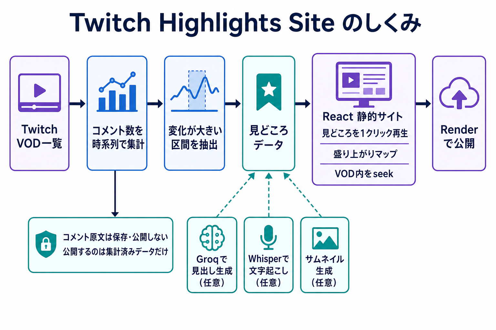

# Twitch Highlights Site

## 公開サイト

https://dotitao-moments.onrender.com/

YouTubeライブアーカイブのコメント量を時間帯ごとに集計し、変化が大きい区間を見どころとして表示する静的サイト基盤です。現在の公開インスタンスは`dotitao moments`です。公開画面はYouTube専用で、VODに応じた再生アダプタを使用します。旧Twitchデータと再生コードは互換テスト用に保持しますが、公開一覧へは出力しません。

> **非公式・非提携について**
> このプロジェクトは独立して開発された非公式ツールであり、Twitchまたは対象チャンネル・配信者の公式製品、提携製品、承認製品、スポンサー製品ではありません。Twitch、チャンネル名、配信者名および関連する名称・商標・コンテンツの権利は各権利者に帰属します。

このリポジトリに含まれる`config/site.json`は、現在の公開サイト`dotitao moments`用のサイト基本設定です。`config/tag-rules.json`は、現在のチャンネルにだけ追加するタグ規則です。汎用ロジック自体は特定の配信者名を前提にしません。

<p align="center">
  
</p>

VODのコメント量から見どころを抽出し、閲覧用の静的サイトとして公開するまでの流れを示しています。

## 主な機能

- YouTube live archiveのOracle経由取得と再生
- コメント量の時系列集計と見どころ抽出
- Groqを利用した見どころ見出し生成とフォールバック
- Whisperを利用できる内部エンリッチメント処理
- 見どころを1クリックで音声付き再生
- 同一VODでのプレイヤー再利用とseek
- コメント量の盛り上がりマップ
- デスクトップ・スマートフォン対応
- 静的公開用`public/`の再現可能な生成
- GitHub Actionsによる定期データ更新

## 構成

```text
frontend/                    React + TypeScript + Vite + Cloudflare Kumoの公開UI
scripts/                     VOD更新、集計、見出し生成、公開ビルド（責務別moduleを含む）
data/                        公開可能な集計データとサムネイル
config/site.json             現在の公開インスタンスのサイト基本設定
config/tag-rules.json        現在のチャンネル固有の追加タグ規則
public/                      公開ビルドの生成先
```

公開UIは`frontend/`を正本とします。`scripts/build_public.sh`が本番バンドルを生成し、許可したVOD集計JSONと見どころサムネイルだけを`public/data/`へコピーします。

公開サイト全体の製品仕様は[`docs/PUBLIC_SITE_SPEC.md`](docs/PUBLIC_SITE_SPEC.md)を正本とします。UIや表示内容を変更する前に、ルートの[`AGENTS.md`](AGENTS.md)とあわせて確認してください。

## 再生仕様

- 初期表示では自動再生せず、ミュート状態で準備します。
- 見どころ、VODタブ、盛り上がりマップを押すと音声付きで再生します。
- 同じVOD内の移動はYouTube IFrame Player APIのseekを使います。
- プレイヤー準備中は最後の操作を優先します。
- 10秒戻るは可能な限り実際の再生位置を基準にします。
- YouTube IFrame Player APIを読み込めない場合はエラーを表示します。

詳細は[`docs/PLAYBACK_SPEC.md`](docs/PLAYBACK_SPEC.md)を参照してください。

## インスタンス設定

`config/site.example.json`を参考に`config/site.json`へサイト名、公開URL、Twitchチャンネル、アクセス解析を設定します。`config/tag-rules.example.json`を参考に`config/tag-rules.json`へ、そのチャンネルにだけ必要な追加タグ規則を設定します。共通タグ規則はコード側に保持し、チャンネル固有の語だけを`tag-rules.json`へ追加します。

次の環境変数またはGitHub Repository Variablesでサイト基本設定を上書きできます。

- `TWITCH_CHANNEL`
- `TWITCH_CHANNEL_ID`
- `SITE_NAME`
- `SITE_DESCRIPTION`
- `SITE_BASE_URL`
- `SITE_LANGUAGE`
- `GOATCOUNTER_CODE`

## ローカル表示

Node.js 20以降を使用します。

```powershell
npm ci --prefix frontend
npm start
```

`http://localhost:4174/`を開きます。開発サーバーはリポジトリの`data/`を`/data/`として読み取り専用で配信します。

## VOD更新・文字起こしのローカル準備

公開画面だけを確認する場合、この追加準備は不要です。VOD更新、Whisper文字起こし、Groq見出し生成、場面サムネイル生成をローカルで実行する場合は、Python 3.11、FFmpeg、TwitchDownloaderCLI 1.56.4を用意し、次を実行します。

```powershell
python -m pip install -r requirements-transcribe.txt
Copy-Item .env.example .env
```

`.env`へTwitch API資格情報を設定します。Groqを使う場合だけ`GROQ_API_KEY`も設定します。依存バージョンとGitHub Actions上のTwitchDownloaderCLIアーカイブは固定・検証されています。

YouTubeのライブアーカイブを生成する場合は、確定済みのOracle VMを唯一のYouTube取得経路として使います。ローカルのyt-dlp直接実行はこの経路に使いません。SSH秘密鍵の内容やCookieはリポジトリへ入れません。

```powershell
$env:YOUTUBE_ORACLE_HOST = '64.110.102.170'
$env:YOUTUBE_ORACLE_USER = 'ubuntu'
$env:YOUTUBE_ORACLE_KEY_PATH = 'C:\00_doc\04_oracle\back\ssh-key-2026-05-20.key'
$env:YOUTUBE_ORACLE_SCRIPT_PATH = 'C:\00_dev\_system\tmp\oracle_livechat.sh'
python scripts/update_vods.py --youtube-url "https://www.youtube.com/watch?v=WGTrmrSvZH0"
```

Oracleスクリプトは`yt-dlp 2026.08.19`、Deno、`/home/ubuntu/youtube-cookies.txt`を使い、`videoOffsetTimeMsec`を含む一時データを解析します。ログ、raw chat、TSVは実行中だけ扱われ、公開データには集計値と見どころだけが保存されます。定期運用は`ops/oracle/youtube-highlight.timer`でOracleから選択区間だけをOCI Object Storageの一時PARへ渡し、`.github/workflows/process-youtube-material.yml`がActions上でWhisper、見出し、サムネイル、検証、checked PR公開を行います。

Oracle timerの秘密値とOCI PAR、GitHub Actions Secretの設定は[`ops/oracle/README.md`](ops/oracle/README.md)を参照してください。既存の`.github/workflows/update-vods.yml`の停止中scheduleはこの経路の完成を待って無条件には再開しません。

## 公開ビルド

```bash
sh scripts/build_public.sh
```

`public/`にはViteの静的バンドル、公開用VOD JSON、見どころサムネイル、`site-config.json`、favicon、robots、sitemapを生成します。Renderは`render.yaml`に従い`public/`を公開します。

## テスト

```powershell
npm run setup
npm run verify
```

Twitch実サービスとデプロイ済みRenderを確認する場合は、通常ゲート成功後に`npm run verify:live`を実行します。対象URLは`config/site.json`の`site.base_url`を正本とし、別環境を確認する場合だけ`LIVE_BASE_URL`で上書きします。

フロントE2EはYouTube IFrame API互換の偽プレイヤーを使い、初期再生方針、音声付きクリック再生、同一VODのseek、別VOD切替、last-click-wins、10秒戻る、PC・スマホ表示を外部通信なしで検証します。

## プライバシー

取得したTwitch/YouTubeコメントは解析中のメモリ上だけで処理します。コメント本文、ユーザー名、コメント単位の投稿時刻をリポジトリやActions用bundleへ保存しません。公開データには時間帯ごとの件数、抽出済み見どころ、生成済み見出し、サムネイルなどの集計結果だけを含めます。

詳細は[`PRIVACY.md`](PRIVACY.md)と[`docs/data-contract.md`](docs/data-contract.md)を参照してください。

## License

[MIT License](LICENSE)
